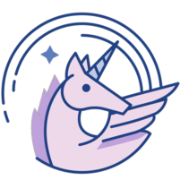
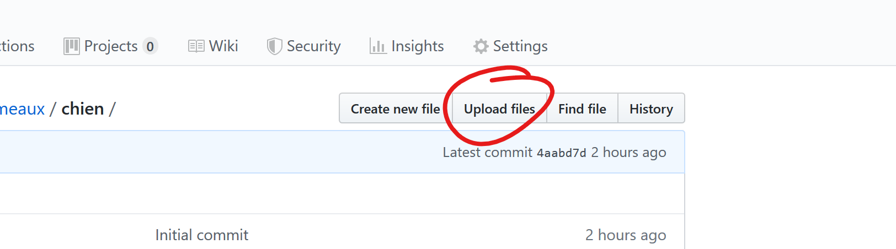

#  Animagus.umontp
### IUT Montpellier-Sète – Département Informatique
* **Colaborateurs:** [étudiants du département informatique](https://iut-montpellier-sete.edu.umontpellier.fr/dut-informatique/)

## Présentation
Inspiré du sort [*animagus*](https://harrypotter.fandom.com/fr/wiki/Animagus) d'Harry Poter, ce bot discord vous feras redécouvrir l'humour caché des animaux. Certains animaux peuvent être immenses, imposants, sinistres voire même terrifiants. Mais n'ayez crainte ! Animagus.umonpt est là ! 

[Cilquez ici pour l'invité sur le votre serveur !](https://discordapp.com/oauth2/authorize?client_id=692397138268651562&scope=bot&permissions=0)
## Comment contribuer facilement 

Vous avez déjà croisé une photo/gif libre de droits d'animale drôle ? Hilarant ? Bah parfait ! Vous pouvez la déposer ici pour pouvoir la partager votre trouvaille avec les autres voici comment faire.

### Première étape : Trouver une image représentant un animal

Bon nous ne chercherons pas un sofa, mais bien un animal, effectuez la recherche de votre animal favori et choisissez l'une des photos libres de droit qui vous ont plu. Puis enregistré la sur votre ordinateur.

### Deuxième étape : Rendez-vous sur le repertoire GitHub

Pour déposer l'image nous nous rendrons à l'URL suivante https://github.com/MathieuSoysal/Animagus.umontp/tree/master/images/animaux.

### Troisième étape : Déposé l'image/gif sur le repertoire GitHub

**Si vous voyez le nom de votre animal** c'est nickel il vous suffira juste de cliquer sur celui-ci et de déposer le fichier via le bouton "Upload files"

**Sinon** pas de soucie, il faut simplement mettre la photo dans un dossier (nommé avec le nom de l'animal choisi) et de déposer le dossier directement dans le répertoire [Animaux/](https://github.com/MathieuSoysal/Animagus.umontp/upload/master/images/animaux) cliquer sur le lien pour aller plus vite.

### Finish !!
Vous avez plus qu'à appuyer sur tous les boutons verts ! Félicitation pour ce premier commit sur le projet ! Le bot se chargera de se mettre à jour et ajouter votre nouvelle image à sa bibliothèque 😎 N'hésitez à faire un tour dans le code !
